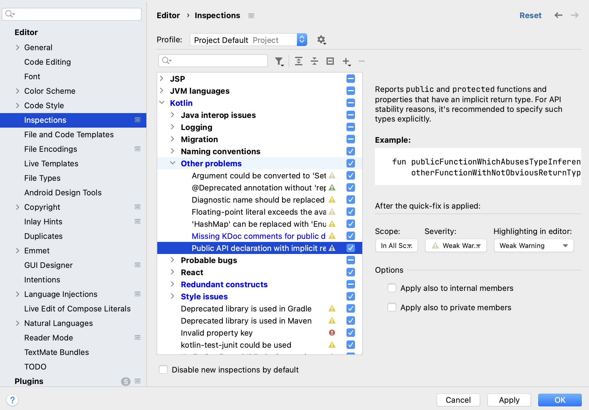
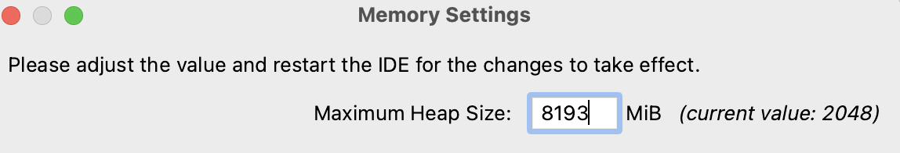

= 2. Setting up IntelliJ IDEA

== 2.1 Formatting and style

=== 2.1.1 Configure the Kotlin plugin
Open IntelliJ IDEA and configure the Kotlin plugin:

* Go to *File* > *Settings* (or *IntelliJ IDEA* > *Preferences* on MacOS) > *Plugins*.
* Search for *Kotlin* in the search bar
* Ensure that the Kotlin plugin is installed and up-to-date. If not, install or update it accordingly

=== 2.1.2 Apply the Kotlin style guide
Set up IDE to automatically to apply the Kotlin style guide including code formatting:

* Go to *File* > *Settings* (or *IntelliJ IDEA* > *Preferences* on MacOS) > *Editor* > *Code Style* > *Kotlin*.
* Click the *Set from* link, then select the *Kotlin Style Guide*.

=== 2.1.3 Enable trailing commas support
Enable trailing commas support in IntelliJ IDEA:

* Go to *File* > *Settings* (or *IntelliJ IDEA* > *Preferences* on macOS) > *Editor* > *Code Style* > *Kotlin*.
* Click on the *Other* tab.
* Check the box that says *Use trailing comma*.

=== 2.1.4  Enable incorrect naming inspection
Set up IDE to check code for incorrect naming:

* Go to *File* > *Settings* (or *IntelliJ IDEA* > *Preferences* on MacOS) > *Editor* > *Inspections* > *Kotlin*.
* Under *Naming conventions*, ensure that all inspections are enabled.

=== 2.1.5 Enable correct code formatting
Enable correct code formatting check:

* Go to *File* > *Settings* (or *IntelliJ IDEA* > *Preferences* on MacOS) > *Editor* > *Inspections* > *General*.
* Enable *Incorrect formatting* inspection.

=== 2.1.5 Enable public API inspections
Enable public API inspections:

* Go to *File* > *Settings* (or *IntelliJ IDEA* > *Preferences* on MacOS) > *Editor* > *Inspections* > *Kotlin* > *Other problems*.
* Enable *Public API declaration with implicit return type* inspection. This is better practice for API stability reasons as well as improves performance of the IDE.
* Enable *Missing KDoc comments for public declarations* so that your public API is documented to ensure your public API is well-documented and to reconsider the visibility of public members

== 2.2 Enhancing developer experience

=== 2.2.1 Enhance IntelliJ's performance

To enhance IntelliJ's performance, allocate 8GB of heap memory if your computer has at least 16GB; otherwise, adjust the memory allocation to a lower, suitable value. The default heap memory for IntelliJ is 2GB

* Navigate to *Help* > *Change Memory Settings*.
* Set the value to 8192 MB (or lower depending on your computer).

* Click *Save and Restart* for the new setting to take effect.

This allocation of additional memory can help IntelliJ run more smoothly, especially when working on large projects.

=== 2.2.2 Enable Autosave
Enabling Autosave helps to prevent losing work due to unexpected crashes or power loss:

* Go to *File* > *Settings* (or *IntelliJ IDEA* > *Preferences* on MacOS) > *Appearance & Behavior* > *System Settings*
* Check the *Save files automatically if application is idle for x seconds* option.

=== 2.2.3 Install the "Rainbow Brackets" and “Key Promoter X” plugins
For better code readability, install the "Rainbow Brackets" plugin. Increase productivity by learning IntelliJ IDEA's keyboard shortcuts with the help of the “Key Promoter X” plugin.

* Go to *File* > *Settings* (or *IntelliJ IDEA* > *Preferences* on MacOS) > *Plugins*.
* Click the *Marketplace* tab.
* Search for "Rainbow Brackets".
* Click *Install*.
* Search for “Key Promoter X”.
* Click *Install* and then restart IntelliJ IDEA to activate new plugins.

➡️ link:./3-create-kotlin-project.adoc[3. Creating a Kotlin Project]

⬅️ link:./1-prerequisites.adoc[1. Prerequisites]