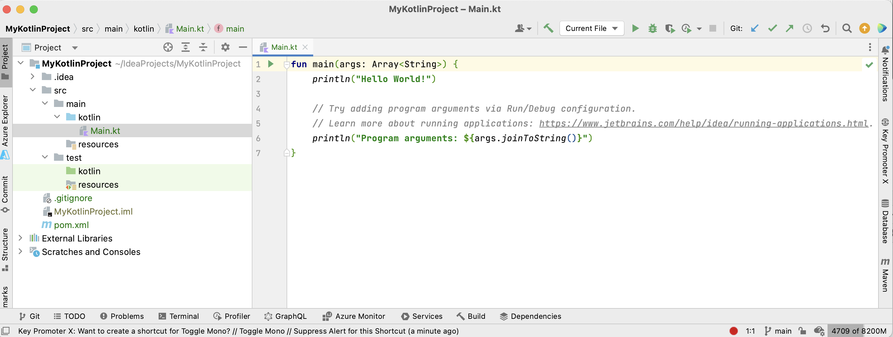

= 3. Creating a Kotlin Project

== 3.1 Create a new Kotlin Project
Create a new Kotlin project, with sample Kotlin code, Maven build system and Git version control.
1. Go to *File* > *New* > *Project* or click *New Project* on the welcome screen.
2. Select *New Project* on the left side menu.
3. Fill in project name, e.g. `MyKotlinProject`.
4. Check *Create Git Repository* checkbox.
5. Choose *Kotlin* language.
6. Select *Maven* build system.
7. From *JDK* dropdown list select JDK 17. If you don't see this option in JDK dropdown list, then select Add JDK to add it from your computer.
8. Check *Add sample code* checkbox.
9. Click *Create* button.

Wait for the project to be created, it can take a few moments.

== 3.2 Inspect project structure
Inspect the default project structure generated by IntelliJ, including the `src` folder, Kotlin source files, and `pom.xml` . You can ignore `.idea` folder and `<YouProjectName>.iml` file (e.g. `MyKotlinProject.iml`) as they are used by IntelliJ as meta-data for the project, and is often excluded from the version control.



[source,bash]
----
MyKotlinProject
├───src
│   ├───main
│   │   ├───kotlin                     # Source code directory
│   │   │   └───Main.kt                # Main.kt file containing the main function
│   │   │
│   │   └───resources                  # Resource files directory
│   │
│   └───test
│       ├───kotlin                     # Test source code directory
│       │   └───MainTest.kt            # MainTest.kt file containing the test functions
│       │
│       └───resources                  # Test resource files directory
│
│   MyKotlinProject.iml                # IntelliJ project module file
│   pom.xml                            # Maven configuration file (POM)

----

== 3.3 Run the program
Try running the main function by either pressing on the green play button on the left size of the function definition, or by right-clicking on `Main.kt` and selecting** Run Main.kt**. You should see output in the console window of IntelliJ:
```
Hello World!
Program arguments:
```

Program arguments are empty before we did not supply any.

Let's add some arguments:

* On the top toolbar choose `Main.kt` and then *Edit Configurations* from the dropdown. Alternatively right-click on `Main.kt` from project view and then go to *More Run/Debug* > *Modify Run Configurations...*
* Add two arguments separated by a space: "Hi there"
* Click *OK*.
* Run the program again by pressing *Shift + F10* (or *Control + R* on MacOS)

You should now see arguments printed to your console:

```
Hello World!
Program arguments: Hi, there
```

You can also run the program by clicking green play button next to `Main.kt` on the top toolbar

➡️ link:./4-setting-up-maven.adoc[4. Setting Up Maven ]

⬅️ link:./2-setting-up-intellij-idea.adoc[2. Setting up IntelliJ IDEA]