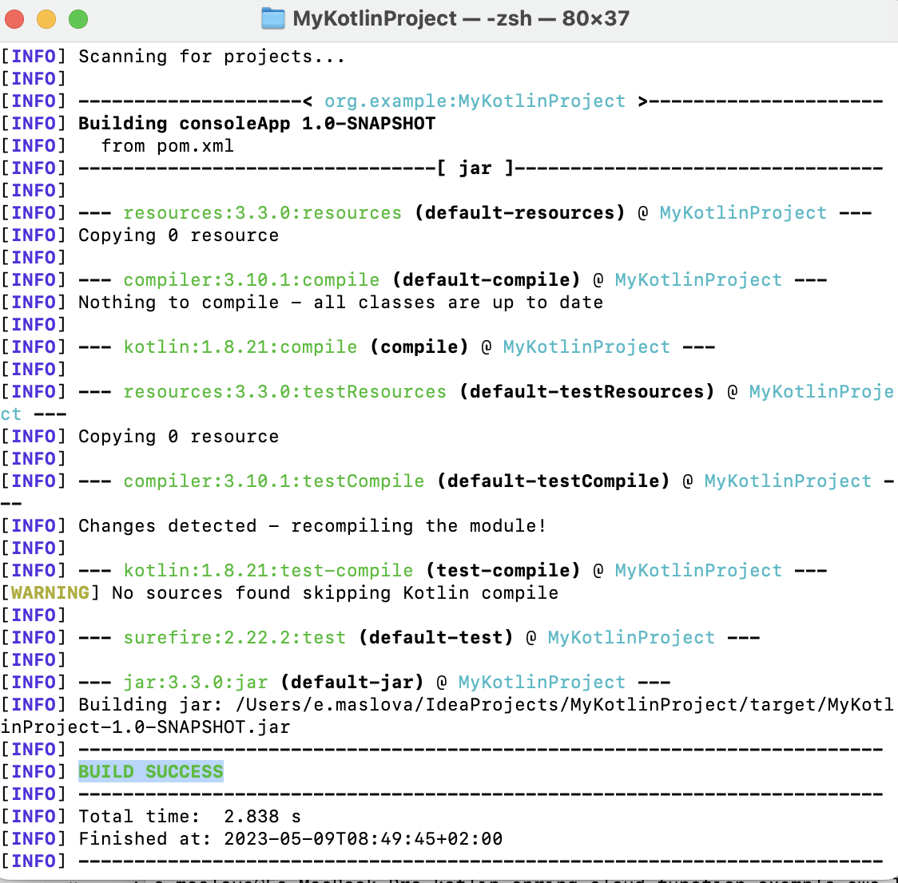
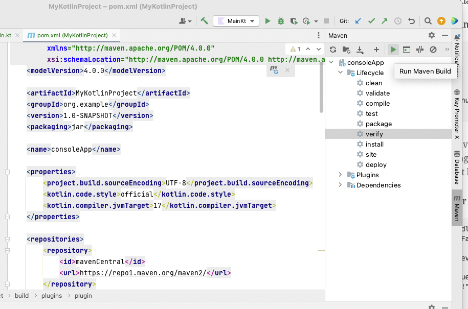

= 4. Setting Up Maven

== 4.1 Inspect pom.xml

Open pom.xml in the root of your project and find and inspect elements:

* `<modelVersion>`: Specifies the version of the Project Object Model (POM) that this file uses, which is 4.0.0.

* `<artifactId>`, `<groupId>`, `<version>`: These elements define the project's unique identifier, which consists of the artifact ID, group ID, and version. The artifact ID is the project's name, the group ID is usually the organization's package name, and the version is the project's current version number.

* `<packaging>`: Defines the packaging type for the project, which is "jar" in this case. This means that the project will be packaged into a JAR file during the build process.

* `<name>`: Provides a human-readable name for the project.

* `<properties>`: Sets various properties that are used throughout the POM file. In this case, it defines the source encoding, Kotlin code style, and the target JVM version for Kotlin code.

* `<repositories>`: Lists the remote repositories that Maven will use to download dependencies. In this case, it specifies the Maven Central Repository.

* `<build>`: Configures the build process, including specifying the source and test directories, as well as the plugins used during the build.

* `<plugins>`: Lists the plugins that Maven will use during the build process. These include the Kotlin Maven plugin for compiling Kotlin code, the Maven Surefire plugin for running tests, the Maven Failsafe plugin for running integration tests, and the Exec Maven plugin for running the main class.

* `<dependencies>`: Specifies the project's dependencies, including the Kotlin standard library, the Kotlin test library with JUnit 5 support, and the JUnit Jupiter engine for running tests.

== 4.2 Ensure JVM Target is 17
Open `pom.xml` and ensure `kotlin.compiler.jvmTarget` has value `17`:
[source,xml]
----
<properties>
    <project.build.sourceEncoding>UTF-8</project.build.sourceEncoding>
    <kotlin.code.style>official</kotlin.code.style>
    <kotlin.compiler.jvmTarget>17</kotlin.compiler.jvmTarget>
</properties>
[source,kotlin]
----

== 4.3 Run maven from command line

=== 4.3.1 Navigate to you project root on command line
    ** Open Windows PowerShell or MacOS terminal
    ** Change directory to the root of your project, e.g.

[source]
----
cd ~/IdeaProjects/MyKotlinProject
----

NOTE: you can use *Tab* key on your keyboard to auto complete

=== 4.3.2 Build you project from command line
Build you project from command line by running the following command from command line:

[source]
----
mvn verify
----

Inspect the output, check what maven was doing and see if you can understand it. You should see `BUILD SUCCESS` at the end with some build time statistics.

=== 4.3.3 Build you project from IntelliJ
    ** In IntelliJ expand *Maven* tab on the right hand side
    ** Expand *consoleApp* > *Lifecycle* in the *Maven* window
    ** Click on *Verify* and press green play button on the toolbar

You should see the same output in IntelliJ *Run* window as you saw on command line in the previous section.

➡️ link:./5-writing-kotlin-program.adoc[5. Writing a Kotlin Program]

⬅️ link:./3-create-kotlin-project.adoc[3. Creating a Kotlin Project]