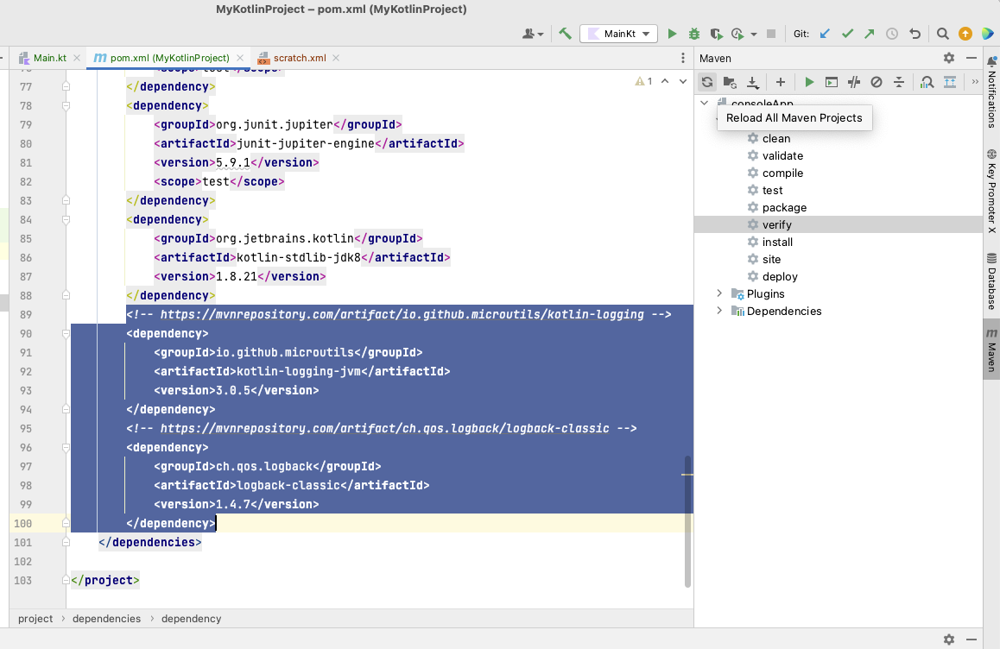
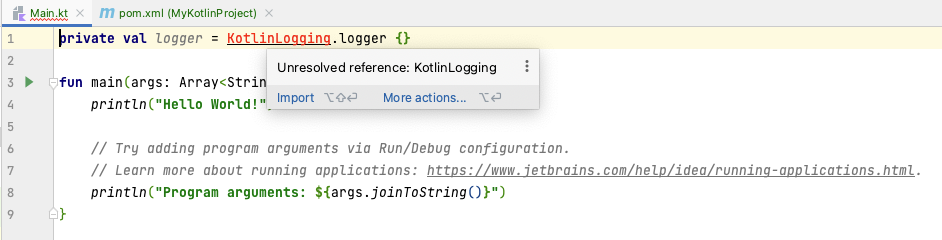

= 5. Writing a Kotlin Program
:sectanchors:

== 5.1 Add required maven dependencies
* Open `pom.xml` and find `dependencies` element
* Add the following two dependencies within `<dependencies>` element
[source,xml]
----
    <!-- https://mvnrepository.com/artifact/io.github.microutils/kotlin-logging -->
    <dependency>
        <groupId>io.github.microutils</groupId>
        <artifactId>kotlin-logging-jvm</artifactId>
        <version>3.0.5</version>
    </dependency>
    <!-- https://mvnrepository.com/artifact/ch.qos.logback/logback-classic -->
    <dependency>
        <groupId>ch.qos.logback</groupId>
        <artifactId>logback-classic</artifactId>
        <version>1.4.7</version>
    </dependency>
----

* Press "Reload All Maven Projects" icon to import dependencies to your project

== 5.2 Add log lines

* Open `/src/main/kotlin/Main.kt`
* Add logger
[source,kotlin]
----
private val logger = KotlinLogging.logger {}
----
* import `KotlinLogging` using IntelliJ auto import. If you hover over the `KotlinLogging` should should see the option to import it. You can use key shortcut or click on *Import* link.

* Add the following log lines to the end of the `main` function:

[source,kotlin]
----
logger.info { "This is an info message" }
logger.debug { "This is a debug message" }
logger.warn { "This is a warning message" }
logger.error { "This is an error message" }
----

Your `Main.kt` should look like this:

[source,kotlin]
----
import mu.KotlinLogging

private val logger = KotlinLogging.logger {}

fun main(args: Array<String>) {
    println("Hello World!")

    // Try adding program arguments via Run/Debug configuration.
    // Learn more about running applications: https://www.jetbrains.com/help/idea/running-applications.html.
    println("Program arguments: ${args.joinToString()}")

    logger.info { "This is an info message" }
    logger.debug { "This is a debug message" }
    logger.warn { "This is a warning message" }
    logger.error { "This is an error message" }
}
----

== 5.3 Run program
* Run the program again, e.g. right-click on `Main.kt` and select ** Run Main.kt**

* You should see additional output in your IntelliJ Run window

[source]
----
09:43:02.144 [main] INFO Main -- This is an info message
09:43:02.150 [main] DEBUG Main -- This is a debug message
09:43:02.150 [main] WARN Main -- This is a warning message
09:43:02.150 [main] ERROR Main -- This is an error message
----
== 5.4 Solution

Your Kotlin program should look similar to this: https://github.com/elenavanengelenmaslova/kotlin-maven-intellij-getting-started/blob/main/src/main/kotlin/Main.kt[Main.kt], with the following Maven https://github.com/elenavanengelenmaslova/kotlin-maven-intellij-getting-started/blob/main/pom.xml[pom.xml].

== 5.5 Additional exercise
If you have time, do https://www.jetbrains.com/help/idea/create-your-first-kotlin-app.html#write-code[Write code] exercise from JetBrains. Only do the *Write code* section of the exercise, as the rest requires you to have set up Gradle and not Maven.

➡️ link:./6-small-assignment.adoc[6. Small assignment]

⬅️ link:./4-setting-up-maven.adoc[4. Setting Up Maven ]
