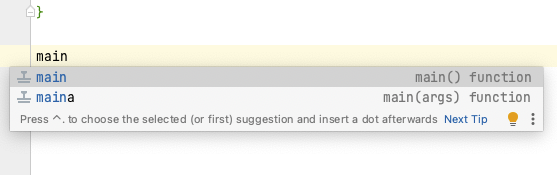

= 6. Small Assignment

In this exercise, you'll be creating a program that generates and outputs five random compliments to the console. Additionally, after each compliment is generated, it will be logged at the INFO log level.

Once you've successfully executed your program, the output should resemble the following:

[source]
----
12:06:55.330 [main] INFO nl.azl.compliment.generator.ComplimentGenerator -- Generated compliment: Amazing work
Compliment: Amazing work
12:06:55.337 [main] INFO nl.azl.compliment.generator.ComplimentGenerator -- Generated compliment: Incredible performance
Compliment: Incredible performance
12:06:55.337 [main] INFO nl.azl.compliment.generator.ComplimentGenerator -- Generated compliment: Great work
Compliment: Great work
12:06:55.337 [main] INFO nl.azl.compliment.generator.ComplimentGenerator -- Generated compliment: Awesome work
Compliment: Awesome work
12:06:55.337 [main] INFO nl.azl.compliment.generator.ComplimentGenerator -- Generated compliment: Fantastic job
Compliment: Fantastic job
----

If you find yourself struggling with the task, remember there is a sample implementation that follows a similar structure in Section 6.7. It's there as a resource to guide you, so feel free to refer to it if necessary. Let's get started!

== 6.1 Create a package
First let us create a package where our compliment generator will reside.

1. In IntelliJ IDEA, open project you created in step <<3-create-kotlin-project.adoc#31-create-a-new-kotlin-project, 3.1>>, provided it isn't currently open.
2. Navigate to *src* > *main* -> *kotlin* folder
3. Right-click on *kotlin* folder, and select *New* > *Package*
4. Enter package name, e.g. `com.example.compliment`, and press *Enter ⏎* key to create a package.

== 6.2 Create ComplimentGenerator class
Now let's create a class that generates random compliments.

1. Right-click on the newly created package and select *New* > *Kotlin Class / File*
2. Enter name `ComplimentGenerator` and press *Enter ⏎* key to create a class

== 6.3 Implement ComplimentGenerator class
1. Start by defining three immutable variables within the class:

* Firstly, create a Kotlin `logger` for logging messages, just like you did in step <<5-writing-kotlin-program.adoc#52-add-log-lines, 5.2>> .
* Next, define a list of `adjectives`, populated with values such as `"Great", "Amazing", "Incredible", "Fantastic", and "Awesome"`.
* Lastly, establish a list of `subjects`, filled with terms like `"job", "work", "effort", "performance", and "attitude"`.

2. Proceed to build a function designed to assemble and return a unique compliment. This function should creat the compliment by selecting one random item from each of your `adjectives` and `subjects` lists.

3. Within this function, before you return the compliment, insert a log statement. This statement should log the freshly generated compliment in the following format: `Generated compliment: $compliment`.

TIP: Consider using the `random` extension function on your lists to conveniently fetch random elements.

== 6.4 Create program entry point - the main function

Next, let's establish the entry point of our program by adding the `main()` function. This function should not take any parameters and shouldn't return any value.

* To add a `main()` function in the *ComplimentGenerator.kt* file, start typing word `main` on the new line after the `ComplimentGenerator` class definition. IntelliJ IDEA will suggest two options:

* Select the first option as our main function does not need command line parameters. This will generate an empty `main()` function.

* Inside the `main()` function, create an instance of the `ComplimentGenerator` class. This is essentially creating our compliment generator.

* With the `ComplimentGenerator` instance ready, call its `generate()` method five times. For each call, print out the resulting compliment directly to the console. This will enable us to view the random compliments generated by our program.

TIP: Kotlin provides a function `repeat(times: Int) { ... }` that allows you to execute the same set of lines multiple times. Consider using this function to simplify your code when generating multiple compliments.

== 6.5 Execute the program

Execute our newly created `ComplimentGenerator` by clicking the green play button next to the main function, or by right-clicking on *ComplimentGenerator.kt* file and selecting *Run ComplimentGenerator.kt*

You should see output similar to this:

----
12:06:55.330 [main] INFO nl.azl.compliment.generator.ComplimentGenerator -- Generated compliment: Amazing work
Compliment: Amazing work
12:06:55.337 [main] INFO nl.azl.compliment.generator.ComplimentGenerator -- Generated compliment: Incredible performance
Compliment: Incredible performance
12:06:55.337 [main] INFO nl.azl.compliment.generator.ComplimentGenerator -- Generated compliment: Great work
Compliment: Great work
12:06:55.337 [main] INFO nl.azl.compliment.generator.ComplimentGenerator -- Generated compliment: Awesome work
Compliment: Awesome work
12:06:55.337 [main] INFO nl.azl.compliment.generator.ComplimentGenerator -- Generated compliment: Fantastic job
Compliment: Fantastic job
----

Consider the difference between the logging statement and the `println` lines. While they might seem similar, they serve distinct purposes in a software application

== 6.6 Add Kdoc comments
 * *Document the class*: Position your cursor just above the class definition line (`class ComplimentGenerator {`). Press enter to create a new line and start your KDoc comment with `/**`. As you hit enter, IntelliJ IDEA will automatically complete it for you. Now, describe the purpose and functionality of the `ComplimentGenerator` class.
 * *Document the function*: Position your cursor just above the `generate()` function definition. Start a new KDoc comment and describe what this function does. Mention that it generates a random compliment, logs it, and returns the compliment.
 * *Document the main function*: In a similar way, add a KDoc comment above the `main()` function. Explain that this is the entry point of the application, and it creates an instance of `ComplimentGenerator`, then generates and prints a compliment 5 times.

== 6.7 Tip: Example program WeatherForecaster

As a *tip* for those who might be finding it challenging, consider a similar program, `WeatherForecaster`, which generates a random weather forecast seven times each time it's executed. It's analogous to the `ComplimentGenerator` application we're creating.

[source,kotlin]
----
package com.example.whether

import mu.KotlinLogging

/**
 * A simple weather forecaster that randomly generates weather conditions.
 */
class WeatherForecaster {
    private val logger = KotlinLogging.logger {}

    // List of possible weather conditions.
    private val conditions = listOf("Sunny", "Rainy", "Cloudy", "Windy", "Snowy")

    /**
     * Generates a random weather condition.
     * Logs the generated forecast.
     *
     * @return a string representing the forecasted weather condition.
     */
    fun forecast(): String {
        val condition = conditions.random()
        logger.info("Forecast: $condition")
        return condition
    }
}

/**
 * The entry point of the application.
 * Creates a WeatherForecaster instance and prints the forecast 7 times.
 */
fun main() {
    val forecaster = WeatherForecaster()
    repeat(7) {
        println("Weather forecast: ${forecaster.forecast()}")
    }
}

----

⬅️ link:./5-writing-kotlin-program.adoc[5. Writing a Kotlin Program ]